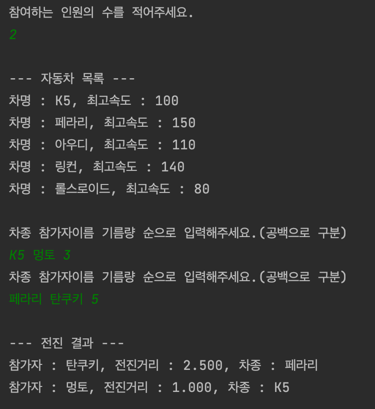
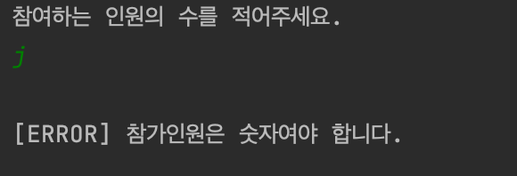

# 자동차 미션

출제자 : 멍토

버전 : 0.0.1v


## 타겟

0년차 주니어 개발자


## 목표

1. 테스트 코드 작성을 경험한다.
2. MVC 패턴을 경험한다.
3. 일급컬렉션을 경험한다.
4. 리팩터링을 경험하며 테스트코드의 중요성을 알아간다.


## 난이도

3(중간)


## 제약사항

1. 메서드 1개당 15줄로 제한한다.
3. 메서드 1개당 인덴트(들여쓰기)는 2개로 제한한다.
   1. if 문이 있다면 인덴트 1개
   2. for 문안에 if문이 있다면 인덴트 2개
6. Test 코드 작성하기
   1. 성공 케이스
   2. 실패 케이스
8. 기능단위로 커밋하기
   1. 커밋 컨벤션을 지킨다. https://gist.github.com/stephenparish/9941e89d80e2bc58a153
9. README 작성
   1. 기능목록
10. 접근 제한자에 유의한다.
    1. 상황에 맞는 접근제한자를 사용하자.
11. 가능하다면 불변을 적용한다.
8. 에러 앞에는 [ERROR] 을 추가한다.
9. else문과 else if, 삼항연산자, switch문을 사용하지 않는다.
10. 객체간의 역할을 나누어 구현한다.
11. Setter를 이용하지 않는다.
12. 출력에 필요한 데이터를 빼고 Getter를 사용하지 않는다.
13. PR 제출시 내용에 아래의 내용을 작성한다.
    1. 미션을 하면서 했던 고민사항
    2. 미션을 하면서 공부한 내용
    3. 미션을 하면서 생긴 궁금한 내용


## 환경

### Java

1. 자바 8버전(1.8)

2. 빌드도구 gradle

   ```java
   dependencies {
       testCompile('org.junit.jupiter:junit-jupiter:5.6.0')
       testCompile('org.assertj:assertj-core:3.15.0')
   }
   ```

3. 구글 자바 컨벤션 지키기(https://google.github.io/styleguide/javaguide.html#s3.4.1-one-top-level-class)

4. 비정상적인 입력에 대해서는 IllegalArgumentException을 발생시킨다.

5. 테스트를 위한 라이브러리는 JUnit5를 이용한다.


## 1차 요구사항

1. 시작시 기본적인 자동차 종류를 제공한다.

| 이름       | 최고속도 |
| ---------- | -------- |
| K5         | 100KM    |
| 페라리     | 150KM    |
| 아우디     | 110KM    |
| 링컨       | 140KM    |
| 롤스로이스 | 80KM     |

2. 사용자에게 몇명의 유저를 입력받을지 입력받는다.
3. 사용자에게 차종 사용자이름과 기름량을 입력받는다. (공백으로 구분)
   1. 차종은 제공된 차량만 가능
   2. 이름 1글자 이상 5글자 이하
   3. 기름은 0L 이상 30L 이하.
4. 자동차는 1분당(한번이동) 속도를 10KM 올라간다.
5. 자동차는 차종의 최고 속도를 넘을 수 없다.
6. 자동차는 1분당(한번이동) 1L를 소비한다.
7. 1분마다 자동차가 전진한 거리를 표시한다.
   1. 1분동안 진행한 거리 : 현재속도 / 60.0
   2. 소수 3번째 자리까지 표현한다.
8. 모든 자동차의 기름이 존재하지 않다면 많이 전진한 순서대로 이름과 전진거리를 출력한다.


### 출력예시







## 2차 요구사항

1차에서 기능이 동작하도록 만들었다면 2차에서는 리팩터링을 통해 기능확장에 용이한 구조로 변경을 한다.


1. MVC 패턴을 적용한다.
   1. view와 model는 서로 몰라야 한다.
   2. pr에 왜 그래야 하는지 고민한 내용 적기
2. 일급컬렉션을 적용한다.
   1. pr에 왜 일급 컬렉션을 적용해야 하는지 고민한 내용 적기


